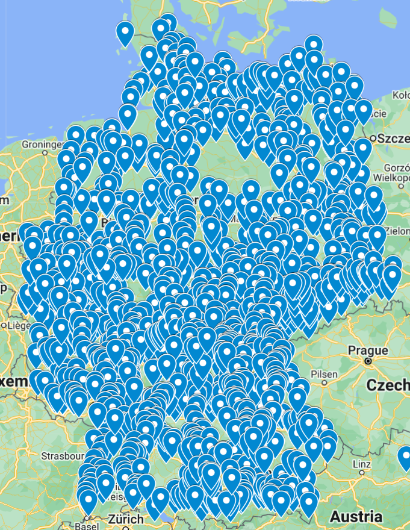

# Tourist Sign Crawler

[](https://github.com/jo-hoe/tourist-sign-crawler/actions?workflow=tests)

Crawls Wikipedia to find tourist signs (in German "Unterrichtstafeln") for famous tourist attractions alongside the Autobahn in Germany.
Afterwards the script tries to find the longitude and latitude of the sights using Wikipedia and openstreetmap.

Some of the sights cannot associated with location data, these item will be logged to stdout and will not be part of the final output.

The output is a `.csv` containing all found locations.

Below is the output of the script plotted on google maps.



## Prerequisites

- [Python](https://www.python.org/downloads/)

### Optional

You can use `make` to start the project.
Make is typically installed out of the box on Linux and Mac.

If you do not have it and run on Windows, you can directly install it from [gnuwin32](https://gnuwin32.sourceforge.net/packages/make.htm) or via `winget`

```PowerShell
winget install GnuWin32.Make
```

## Run

### Make

Use `make init` to install all required dependencies.
Afterwards use `make` to run the project.
